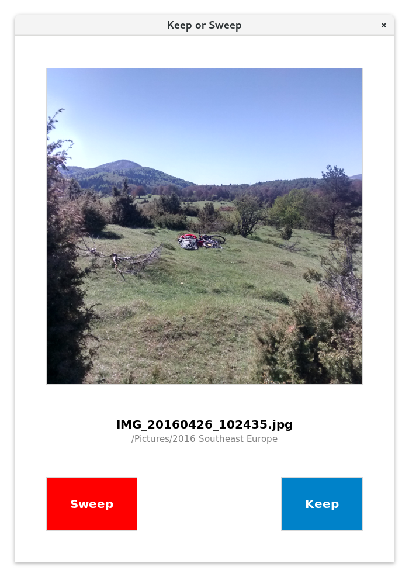

# 💻🔀🗑️ Keep or Sweep

**Randomly clean data off your computer!**

This is the desktop version for Windows, macOS & Linux. There’s also a [Nextcloud app](https://github.com/keeporsweep/keeporsweep), and more info at [keeporsweep.net](http://keeporsweep.net).



## Installation

1. Install the dependencies: We need [Pillow](https://pillow.readthedocs.io/en/latest/installation.html) (Python library for image handling) and [Send2Trash](https://github.com/hsoft/send2trash) (to move files to trash cross-platform instead of permanently removing them). Type these commands in a terminal window:
```
sudo easy_install pip
pip3 install Pillow
pip3 install Send2Trash
```
2. Make `keeporsweep.py` executable by right-click → Properties → Allow executing file as program. (Or in the terminal with `chmod +x keeporsweep.py`)
3. Then place `keeporsweep.py` in any folder and click it! 🎉 (Or in the terminal run `python3 keeporsweep.py`)
